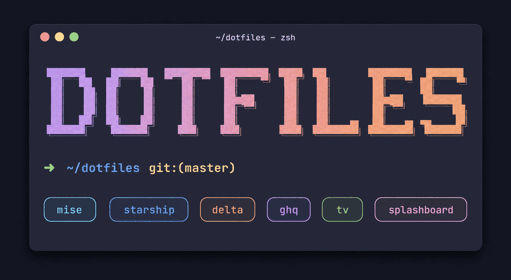

<p align="center">
  
</p>

<p align="center">
  <strong>my awesome dotfiles ♥</strong><br>
  <sub>personal zsh + mise setup, managed with homeshick.</sub>
</p>

## Install

This repository is managed with [homeshick](https://github.com/andsens/homeshick).

```sh
homeshick clone git@github.com:unhappychoice/dotfiles
homeshick link dotfiles
```

After linking, install the OS-specific `gpg-agent.conf` (auto-detects WSL / macOS):

```sh
~/.homesick/repos/dotfiles/bin/setup-gpg-agent.sh
```

## What's inside

- **Shell**: zsh + [starship](https://starship.rs/) prompt, splashboard on launch
- **Toolchain**: [mise](https://mise.jdx.dev/) for Go / Node / Python / Ruby / Rust and CLI tools
- **Git**: [delta](https://github.com/dandavison/delta) pager, [ghq](https://github.com/x-motemen/ghq) repo manager, GPG-signed commits
- **Pickers**: [television](https://github.com/alexpasmantier/television) (`tv`) wired to ssh hosts, ghq repos, branches, history, npm scripts, ripgrep
- **Misc**: direnv, [nano](https://www.nano-editor.org/) as default editor
- **AI agents**: shared language and style rules for Claude Code / Codex
